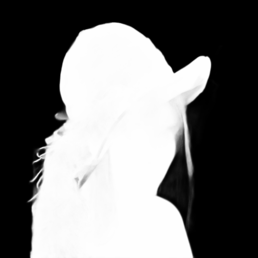

# DIS-inference

[](https://pypi.org/project/dis-inference)
[](https://pypi.org/project/dis-inference)

Inference implementation of Dichotomous Image Segmentation
## [Highly Accurate Dichotomous Image Segmentation (ECCV 2022)](https://arxiv.org/pdf/2203.03041.pdf)
#### [Xuebin Qin](https://xuebinqin.github.io/), [Hang Dai](https://scholar.google.co.uk/citations?user=6yvjpQQAAAAJ&hl=en), [Xiaobin Hu](https://scholar.google.de/citations?user=3lMuodUAAAAJ&hl=en), [Deng-Ping Fan*](https://dengpingfan.github.io/), [Ling Shao](https://scholar.google.com/citations?user=z84rLjoAAAAJ&hl=en), [Luc Van Gool](https://scholar.google.com/citations?user=TwMib_QAAAAJ&hl=en).
[**Project Page**](https://xuebinqin.github.io/dis/index.html), [**Arxiv**](https://arxiv.org/pdf/2203.03041.pdf), [**中文**](https://github.com/xuebinqin/xuebinqin.github.io/blob/main/ECCV2022_DIS_Chinese.pdf).

<br>

| Origin | DIS |
|--|--|
|||

<br>

**Table of Contents**

- [Installation](#installation)
- [Usage](#usage)
- [License](#license)
- [Reference](#reference)

## Installation

```console
pip install dis-inference
```

## Usage
### CLI
command:  `dis-inference`
arguments:
　　--silent(optional) : Whether to print verbose.  Source image
```console
> dis-inference Lenna.png
Output saved as `Lenna_dis.png`
> dis-inference --silent Lenna.png
```

### Python
```python
from dis_inference import inference

# 1. Used in memory
image = inference('Lenna.png')
cv2.imwrite('Lenna_dis.png', image)

# 2. With save parameter
image = inference('Lenna.png', save=True)
```

## License

`dis-inference` is distributed under the terms of the [AGPL-3.0-only](https://spdx.org/licenses/AGPL-3.0-only.html) license.

## Reference

https://github.com/xuebinqin/DIS

## Citation

```
@InProceedings{qin2022,
      author={Xuebin Qin and Hang Dai and Xiaobin Hu and Deng-Ping Fan and Ling Shao and Luc Van Gool},
      title={Highly Accurate Dichotomous Image Segmentation},
      booktitle={ECCV},
      year={2022}
}
```
